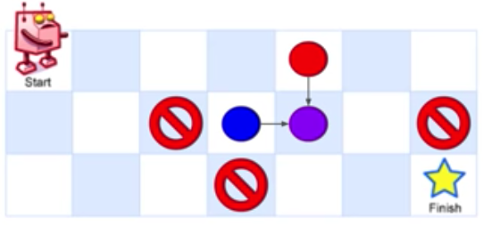

## Question:

A robot is located at the top-left corner of a `m x n` grid (marked 'Start' in the diagram below).

The robot can only move either down or right at any point in time. The robot is trying to reach the bottom-right corner of the grid (marked 'Finish' in the diagram below).

Now consider if some obstacles are added to the grids. How many unique paths would there be?

An obstacle and space is marked as `1` and `0` respectively in the grid.

 

**Example 1:**



```
Input: obstacleGrid = [[0,0,0],[0,1,0],[0,0,0]]
Output: 2
Explanation: There is one obstacle in the middle of the 3x3 grid above.
There are two ways to reach the bottom-right corner:
1. Right -> Right -> Down -> Down
2. Down -> Down -> Right -> Right
```

## High Level Idea:

- Recursion with memo
  - subproblems:
    - A = f(m -1, n)
    - B = f(m, n - 1)
  - Recursion rule;
    - numbers of A + numbers of B
  - Base Case:
    - m == 0 or n == 0 --> return 0
    - m == 1 && n == 1 --> return 1
- Complexity Analysis:
  - Time: O(2^n), with memo O(n)
  - Space: O(m*n)

## Simulation:

```java
/*
                                     m,n
      															(3,2)
                                  /         \
                              (2,2)          (3,1)
                            /      \        /     \
                         (1,2)    (2,1)  (2,1)    (3,0)
                       /   \     /    \  /   \
                   (0,2) (1,1)(1,1)(2,0)(1,1) (2,0)
                   
                   base case:
                   1. m == 0 or n == 0 --> return 0
                   2. m == 1 && n == 1 --> return 1 - grid[0][0]
```


## Recursion Solution With Memo:

```java
class Solution {
    public int uniquePathsWithObstacles(int[][] obstacleGrid) {
        int rows = obstacleGrid.length;
        int cols = obstacleGrid[0].length;
        int[][] memo = new int[rows][cols];
        return helper(rows, cols, obstacleGrid, memo);
    }
    
    private int helper(int m, int n, int[][] grid, int[][] memo) {
        if (m <= 0 || n <= 0) {
            return 0;
        }
        //consider that if obstacle at (1,1)
        if (m == 1 && n == 1) {
            return 1 - grid[0][0];
        }
        //search in memo
        if (memo[m - 1][n - 1] != 0) {
            return memo[m - 1][n - 1];
        }
        
        //set value to memo
        if (grid[m - 1][n - 1] == 1) {
            memo[m - 1][n - 1] = 0;
        } else {
            memo[m - 1][n - 1] = helper(m - 1, n, grid, memo) + helper(m, n - 1, grid, memo);
        }

        return memo[m - 1][n - 1];
    }
}
```

## DP Solution:

```java
class Solution {
    public int uniquePathsWithObstacles(int[][] obstacleGrid) {
        int rows = obstacleGrid.length;
        int cols = obstacleGrid[0].length;
        int[][] memo = new int[rows][cols];
        // base case
        memo[0][0] = obstacleGrid[0][0] == 1 ? 0 : 1;
        
        for (int r = 0; r < rows; r++) {
            for (int c = 0; c < cols; c++) {
                if (obstacleGrid[r][c] == 1) {
                    memo[r][c] = 0;
                } else {
                  //deal with border
                    memo[r][c] += r > 0 ? memo[r - 1][c] : 0;
                    memo[r][c] += c > 0 ? memo[r][c - 1] : 0;
                }
            }
        }
        return memo[rows - 1][cols - 1];
    }
}
```

end.