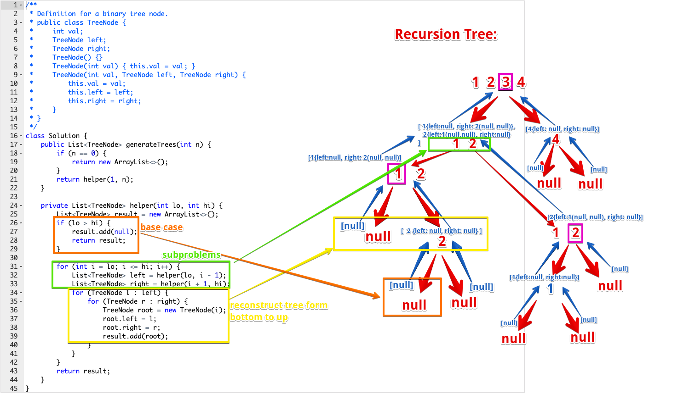

## Question:

Given an integer `n`, generate all structurally unique **BST's** (binary search trees) that store values 1 ... *n*.

**Example:**

```
Input: 3
Output:
[
  [1,null,3,2],
  [3,2,null,1],
  [3,1,null,null,2],
  [2,1,3],
  [1,null,2,null,3]
]
Explanation:
The above output corresponds to the 5 unique BST's shown below:

   1         3     3      2      1
    \       /     /      / \      \
     3     2     1      1   3      2
    /     /       \                 \
   2     1         2                 3
```

## High Level Idea:

- Recursion
  - subproblems:
    - left subtree and right subtree
  - Recursion rule;
    - reconstruct tree from boottom to up
    - total unique trees = # left subtree * # right subtree
  - Base Case:
    - lo > hi
- Complexity Analysis:
  - Time: O(n^2)
  - Space: O(n)

## Simulation:



## **Solution:**

```java
class Solution {
    public List<TreeNode> generateTrees(int n) {
        if (n == 0) {
            return new ArrayList<>();
        }
        return helper(1, n);
    }
    
    private List<TreeNode> helper(int lo, int hi) {
        List<TreeNode> result = new ArrayList<>();
        //base case
        if (lo > hi) {
            result.add(null);
            return result;
        }
        
        //subproblem to reach boootm
        for (int i = lo; i <= hi; i++) {
            List<TreeNode> left = helper(lo, i - 1);
            List<TreeNode> right = helper(i + 1, hi);
            //reconstruct tree from bottom to up
            for (TreeNode l : left) {
                for (TreeNode r : right) {
                    TreeNode root = new TreeNode(i);
                    root.left = l;
                    root.right = r;
                    result.add(root);
                }
            }
        }
        //return list of root to last layer
        return result;
    }
}
```

end.